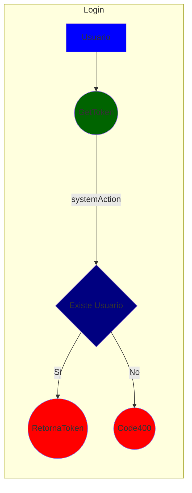

## personal-manager-backend-login

```mermaid
graph LR

    subgraph Login
        Usuario[Usuario]-->
        GetToken((GetToken))---->|systemAction| C{Existe Usuario}
        C-->|Si| ReturnOK((RetornaToken))
        C-->|No| Return400((Code400))

        style Usuario fill: blue
        style GetToken fill: darkgreen
        style C fill: navy
        style ReturnOK fill: red
        style Return400 fill: red
    end


   


```